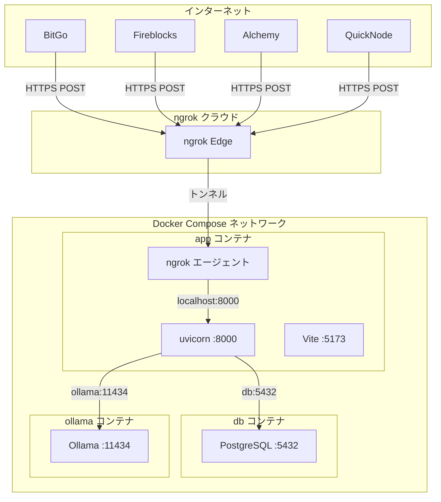
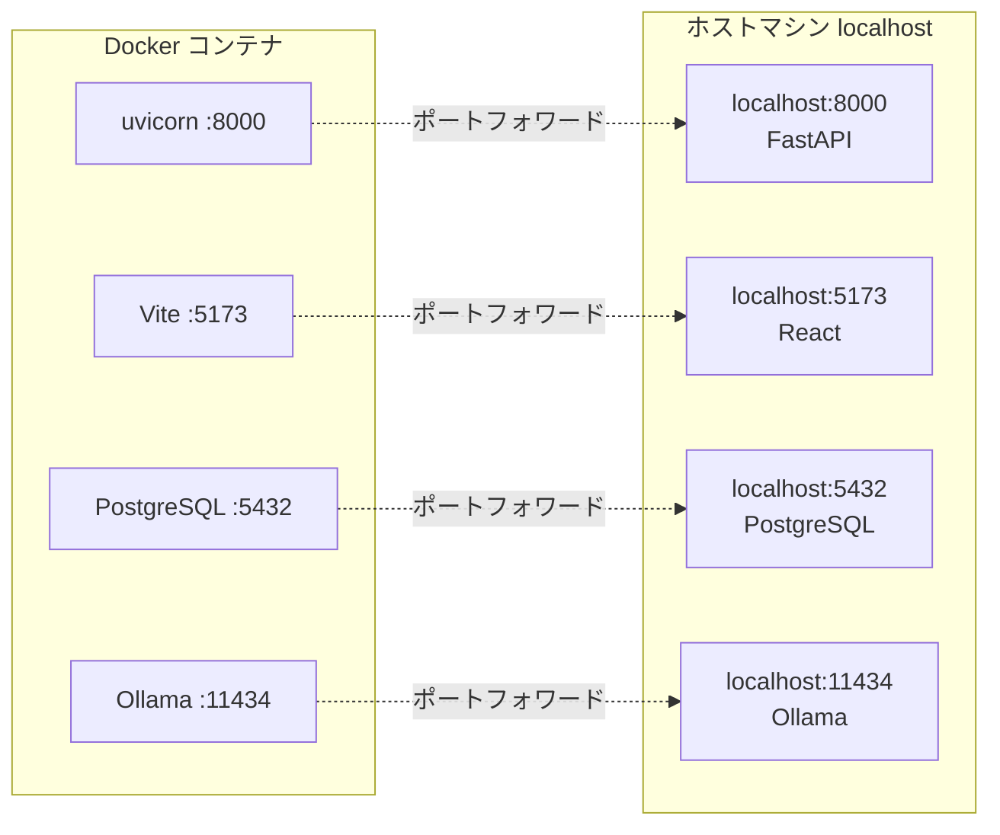

# Webhook Analyzer ネットワーク構成図

## 全体像（外部フロー）



## ホスト ⇔ コンテナ ポートフォワード



Dev Container がコンテナの各ポートをホストの localhost に自動マッピング。ブラウザは localhost:5173（フロント）、localhost:8000（API）にアクセス。

## ポートマッピング一覧

| レイヤー | アドレス | サービス | 備考 |
|----------|----------|----------|------|
| **インターネット** | `https://xxx.ngrok-free.app` | ngrok 公開URL | Webhook 受信先。BitGo 等がここへ POST |
| **ngrok 内側** | `http://127.0.0.1:4040` | ngrok Web UI | トラフィック確認（コンテナ内のみ、未フォワード） |
| **ホスト** | `localhost:8000` | FastAPI | Dev Container が自動フォワード |
| **ホスト** | `localhost:5173` | Vite (React) | Dev Container が自動フォワード |
| **ホスト** | `localhost:5432` | PostgreSQL | Dev Container が自動フォワード |
| **ホスト** | `localhost:11434` | Ollama API | Dev Container が自動フォワード |
| **app コンテナ** | `0.0.0.0:8000` | uvicorn | ngrok は localhost:8000 に転送 |
| **app コンテナ** | `0.0.0.0:5173` | Vite | |
| **db コンテナ** | `db:5432` | PostgreSQL | コンテナ間はホスト名で通信 |
| **ollama コンテナ** | `ollama:11434` | Ollama | コンテナ間はホスト名で通信 |

## データフロー: 外部 Webhook 受信

```
[BitGo/Fireblocks 等]
    |
    | HTTPS POST
    v
[ngrok クラウド] (xxx.ngrok-free.app)
    |
    | トンネル (ngrok エージェント経由)
    v
[app コンテナ内 ngrok] ngrok http 8000
    |
    | http://localhost:8000 へ転送
    v
[uvicorn] POST /api/webhooks/receive
    |
    +---> [PostgreSQL db:5432] 保存
    |
    +---> [Ollama ollama:11434] AI 分析時のみ
    |
    v
[201 Created] JSON レスポンス
```

## データフロー: ホストのブラウザからアクセス

```
[ホストのブラウザ]
    |
    | http://localhost:5173  (フロントエンド)
    v
[Dev Container ポートフォワード]
    |
    v
[app コンテナ Vite]
    |
    | /api/* はプロキシで
    v
[uvicorn localhost:8000]
```

## 補足

- **ngrok** は app コンテナ内で `ngrok http 8000` を実行。ngrok クラウドが受け取ったリクエストを、そのコンテナの localhost:8000 に転送する。
- **ポートフォワード** は Cursor / VS Code の Dev Container 機能により、コンテナのポートがホストの localhost にマッピングされる。
- **コンテナ間通信** は Docker の内部 DNS により、サービス名（`db`, `ollama`）で解決される。
